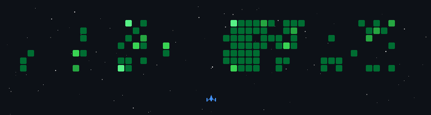

#  Hi, I'm Aniket Adhav

### 🚀 Full Stack Developer • Android Developer • Competitive Programmer

 

  

---

# 💫 About Me

<table>
<tr>

<td width="60%">

### 👨‍💻 Hello!

🎓 Computer Engineering Student at **Dr. D. Y. Patil Institute of Technology, Pune**

💙 Passionate about developing **Full Stack Web Applications** and **Native Android Apps**.

🏆 Knight on LeetCode with **700+ DSA Problems Solved**.

🚀 Currently exploring **Java**, **Spring Boot**, **System Design**, **Cloud Computing**, and **Artificial Intelligence**.

✨ I enjoy building impactful software, solving challenging problems, and continuously learning new technologies.

</td>

<td align="center" width="40%">

</td>

</tr>
</table>

---

<h2 align="center">🌐 Connect With Me</h2>

---

<!-- ═══════════════════════════════════════════════════════════════════════ -->
<!-- 🛠 TECH STACK -->
<!-- ═══════════════════════════════════════════════════════════════════════ -->

## 🛠 Tech Stack

<i>Technologies I use to build scalable, modern and user-friendly applications.</i>

  

<!-- 💻 Languages -->

### 💻 Languages

---

### 🌐 Web Development

---

### 📱 Android Development

---

### 🗄️ Databases

---

### 🤖 AI & Machine Learning

---

### 🔧 Tools & Platforms

---

# 📊 GitHub Analytics

 

 

 

 

---

## ⭐ Thanks for Visiting!

If you like my work, consider giving a ⭐ to my repositories and connecting with me.

